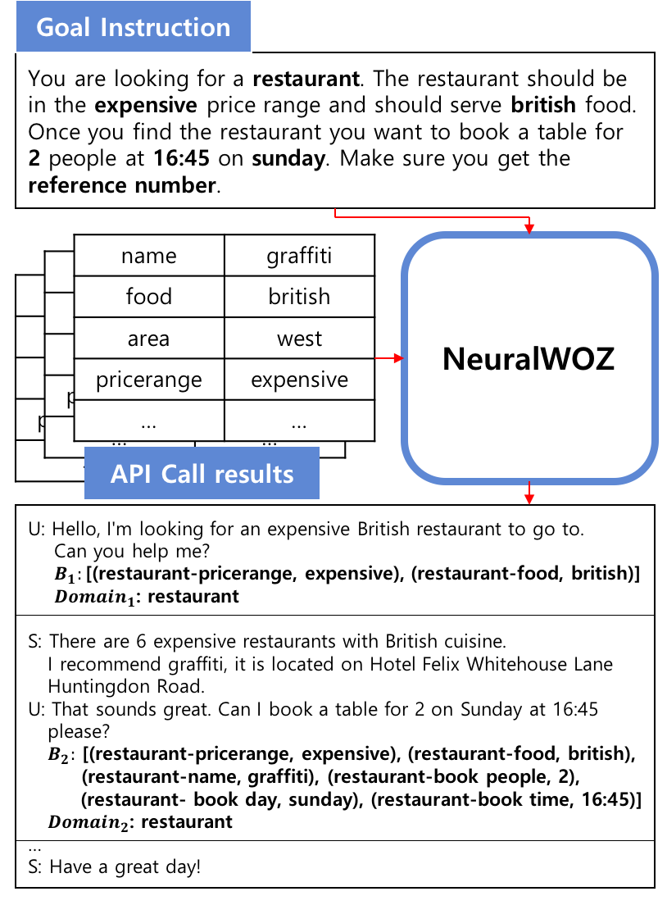
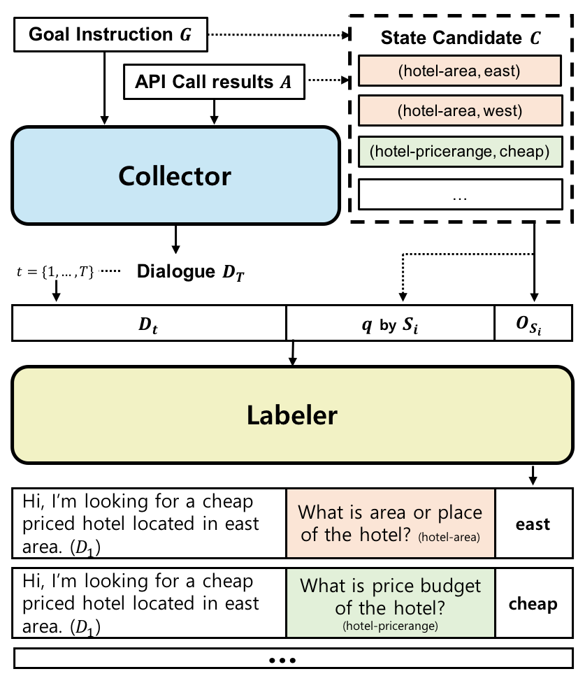

# NeuralWOZ

This code is official implementation of "[NeuralWOZ: Learning to Collect Task-Oriented Dialogue via Model-based Simulation](https://arxiv.org/abs/2105.14454)". <br>

> [Sungdong Kim](https://github.com/dsksd), [Minsuk Chang](https://minsukchang.com), [Sang-woo Lee](https://scholar.google.co.kr/citations?user=TMTTMuQAAAAJ)<br>
> In ACL 2021.


<p align="center">
    
    
</p>


## Citation


```bibtex
@inproceedings{kim2021neuralwoz,
  title={NeuralWOZ: Learning to Collect Task-Oriented Dialogue via Model-based Simulation},
  author={Kim, Sungdong and Chang, Minsuk and Lee, Sang-woo},
  booktitle={ACL},
  year={2021}
}
```


## Requirements

```
python3.6
torch==1.4.0
transformers==2.11.0
```

Please install [apex](https://github.com/NVIDIA/apex) for the mixed precision training. <br>
See details in requirements.txt <br>


## Data Download and Preprocessing

### 1. Download dataset

Please run this script at first. It will create `data` repository, and save and preprocess MultiWOZ 2.1 dataset.

```
python3 create_data.py
```

### 2. Preprocessing

To train NeuralWOZ under various settings, you should create each training instances with running below script. <br>

```
python3 neuralwoz/preprocess.py --exceptd $TARGET_DOMAIN --fewshot_ratio $FEWSHOT_RATIO
```

- exceptd: Specify "target domain" to exclude from training dataset for leave-one-out scheme. It is one of the (hotel|restaurant|attraction|train|taxi).
- fewshot_ratio: Choose proportion of examples in the target domain to include. Default is 0. which means zero-shot. It is one of the (0.|0.01|0.05|0.1). You can check the fewshot examples in the `assets/fewshot_key.json`.


This script will create `"$TARGET_DOMAIN_$FEWSHOT_RATIO_collector_(train|dev).json"` and `"$TARGET_DOMAIN_$FEWSHOT_RATIO_labeler_train.h5"`. <br>

## Training NeuralWOZ

You should specify `output_path` to save the trained model. <br>
Each output consists of the below four files after the training.

- pytorch_model.bin
- config.json
- vocab.json
- merges.txt

For each zero/few-shot settings, you should set the `TRAIN_DATA` and `DEV_DATA` from the preprocessing. For example, `hotel_0.0_collector_(train|dev).json` should be used for the Collector training when the target domain is hotel in the zero-shot domain transfer task. <br>

We use `N_GPU=4` and `N_ACCUM=2` for Collector training and `N_GPU=2` and `N_ACCUM=2` for Labeler training to fit 32 for batch size based on V100 32GB GPU. <br>

### 1. Collector

```
python3 neuralwoz/train_collector.py \
  --dataset_dir data \
  --output_path $OUTPUT_PATH \
  --model_name_or_path facebook/bart-large \
  --train_data $TRAIN_DATA \
  --dev_data $DEV_DATA \
  --n_gpu $N_GPU \
  --per_gpu_train_batch_size 4 \
  --num_train_epochs 30 \
  --learning_rate 1e-5 \
  --gradient_accumulation_steps $N_ACCUM \
  --warmup_steps 1000 \
  --fp16
```

### 2. Labeler

```
python3 neuralwoz/train_labeler.py \
  --dataset_dir data \
  --output_path $OUTPUT_PATH \
  --model_name_or_path roberta-base-dream \
  --train_data $TRAIN_DATA \
  --dev_data labeler_dev_data.json \
  --n_gpu $N_GPU \
  --per_gpu_train_batch_size 8 \
  --num_train_epochs 10 \
  --learning_rate 1e-5 \
  --gradient_accumulation_steps $N_ACCUM \
  --warmup_steps 1000 \
  --beta 5. \
  --fp16
```


## Download Synthetic Dialogues from NeuralWOZ

Please download synthetic dialogues from [here](https://drive.google.com/drive/folders/1Tp5CsejVMvWWCn8noPoPys7zN8kfTD_P?usp=sharing) <br>

- The naming convention is `nwoz_{target_domain}_{fewshot_proportion}.json`
- Each dataset contains synthesized dialogues from our NeuralWOZ
- Specifically, It contains synthetic dialogues for the `target_domain` while excluding original dialogues for the target domain (leave-one-out setup)
- You can check the i-th synthesized dialogue in each files with `aug_{target_domain}_{fewshot_proprotion}_{i}` for `dialogue_idx` key.
- You can use the json file to directly train zero/few-shot learner for DST task
- Please see [readme](#) for training TRADE and [readme](#) for training SUMBT using the dataset
- If you want to synthesize your own dialogues, please see below sections.


## Download Pretrained Models

Pretrained models are available in [this link](https://drive.google.com/drive/folders/1hWqNY5D0IJBXP8FncCwn3fQN4c1HV01F?usp=sharing). The naming convention is like below

- NEURALWOZ: `(Collector|Labeler)_{target_domain}_{fewshot_proportion}.tar.gz`
- TRADE: `nwoz_TRADE_{target_domain}_{fewshot_proportion}.tar.gz`
- SUMBT: `nwoz_SUMBT_{target_domain}_{fewshot_proportion}.tar.gz`

To synthesize your own dialogues, please download and unzip both of Collector and Labeler in same `target domain` and `fewshot_proportion` at $COLLECTOR_PATH and $LABELER_PATH, repectively. <br>

Please use `tar -zxvf MODEL.tar.gz` for the unzipping.


## Generate Synthetic Dialogues using NeuralWOZ

```
python3 neuralwoz/run_neuralwoz.py \
  --dataset_dir data \
  --output_dir data \
  --output_file_name neuralwoz-output.json \
  --target_data collector_dev_data.json \
  --include_domain $TARGET_DOMAIN \
  --collector_path $COLLECTOR_PATH \
  --labeler_path $LABELER_PATH \
  --num_dialogues $NUM_DIALOGUES \
  --batch_size 16 \
  --num_beams 1 \
  --top_k 0 \
  --top_p 0.98 \
  --temperature 0.9 \
  --include_missing_dontcare
```

## License

```
Copyright 2021-present NAVER Corp.

Licensed under the Apache License, Version 2.0 (the "License");
you may not use this file except in compliance with the License.
You may obtain a copy of the License at

    http://www.apache.org/licenses/LICENSE-2.0

Unless required by applicable law or agreed to in writing, software
distributed under the License is distributed on an "AS IS" BASIS,
WITHOUT WARRANTIES OR CONDITIONS OF ANY KIND, either express or implied.
See the License for the specific language governing permissions and
limitations under the License.
```
